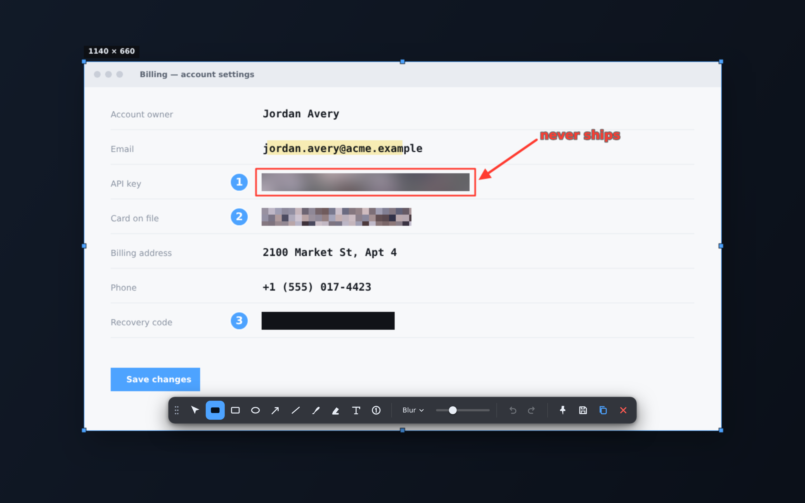

# Voidshot

Screenshot tool with redaction that actually cannot be undone.

Global hotkey → freeze the screen → select a region → annotate → copy, save or
pin. Metadata is stripped on the way out, always.

<p align="center">
  
</p>

> **Blur, Mosaic and Solid** on the same shot — all three throw the original
> pixels away and paint synthetic content in their place. Depix and Unredacter
> have nothing to reconstruct. [Why, and how it's proven ↓](#why-the-redaction-is-different)

---

## Why the redaction is different

Blur and pixelation are **reversible transformations of the original pixels**.
That is not a theoretical concern:

- **Depix** reconstructs pixelated text, especially monospaced UI and console text.
- **Unredacter** (Bishop Fox) brute-forces what Depix cannot.
- Small-radius Gaussian blur can be undone by deconvolution.

"I blurred it" is not the same as "it is gone".

Voidshot never transforms the hidden pixels. It **discards** them and paints
synthetic content in their place:

1. Noise is generated from a PRNG seeded by a random number.
2. That noise is blurred (or blocked, or flattened) so it reads as a familiar redaction.
3. It is composited fully opaque over the region, replacing every pixel.

The replacement is derived from a random seed and **nothing else**. It has zero
mutual information with what was underneath, so there is no signal left to
recover — not by deconvolution, not by brute force, not by a tool that does not
exist yet.

Three styles, all equally irreversible:

| Style | Looks like | Contains |
|---|---|---|
| **Blur** | a normal blur | nothing |
| **Mosaic** | normal pixelation | nothing |
| **Solid** | a flat block | nothing |

### This is tested, not asserted

`npm test` runs the proof. The decisive check is **content independence**:
redact two completely different images with the same seed and the output must be
byte-identical. Output that does not vary with the input carries no information
about the input.

```
PASS  content independence [blur]        0 of 93600 bytes differ between two different source images
PASS  content independence [mosaic]      0 of 93600 bytes differ between two different source images
PASS  content independence [solid]       0 of 93600 bytes differ between two different source images
PASS  full opacity [blur/mosaic/solid]   0 translucent pixels inside the box
PASS  no bleed outside box               0 pixels changed outside the box
PASS  hard edges                         0 differing bytes across the 4 boundary lines
PASS  seed variation                     74.4% of bytes differ across seeds
PASS  no signal in correlation           mean|r| secret=0.0631 vs control=0.0710, Welch t=-0.87
PASS  exported image is redacted         0 of 93600 exported bytes differ between two different sources
PASS  export control (outside box)       2800 bytes differ outside the box — proves the test is live

19/19 passed
```

A note on the correlation test: a single Pearson *r* between the original and
the redaction is **not** a valid leak test. Both are spatially smooth fields, so
the effective sample count is the number of blobs (a few dozen), not the pixel
count — two independent smooth fields routinely correlate at |r| ≈ 0.2 by pure
chance. The test therefore compares correlation against the true secret with
correlation against an unrelated control image. Identical distributions mean the
correlation is noise.

---

## The other leaks, closed

Getting the pixels right is not enough. These are the ways redacted screenshots
leak in practice:

| Leak | What Voidshot does |
|---|---|
| **EXIF thumbnail** — the embedded preview stays un-redacted while the main image is edited | Every image is decoded to raw pixels and re-encoded from scratch. No EXIF, XMP, IPTC, ICC or text chunks survive, thumbnail included. |
| **Acropalypse** (CVE-2023-28303) — Snipping Tool wrote a shorter image into an existing file without truncating, leaving the original recoverable | Files are never patched. A fresh temp file is written, fsynced, and renamed into place. |
| **Layers / editable overlays** | Export is a flat bitmap. No shape list, no history — a redaction cannot be "turned off" because there is nothing to turn off. |
| **Antialiased edges** blending originals into the boundary row | Redaction snaps to whole pixels with smoothing disabled. |
| **Box shape leaking the length** of what was hidden | Configurable padding grows each box beyond its content. |
| **Clipboard** holding a pre-redaction copy | Only the flattened result is ever put on the clipboard. |
| **Temp files** with sensitive pixels | The capture never touches disk; the OCR fallback path deletes its input unconditionally. |

Both the metadata strip and the acropalypse guard have Rust regression tests
(`npm run test:rust`).

---

## Features

- **Global hotkey** capture (PrintScreen by default on Windows), tray icon, runs in background
- **Full screen instantly** with `Ctrl`+`PrintScreen` — straight to clipboard and the save folder
- **Multi-monitor** with mixed DPI — monitors are stitched into one virtual desktop
- **Live editor**: rectangle, ellipse, arrow, line, pen, highlighter, text, numbered steps
- **Safe Blur** in three styles, with adjustable strength and padding
- **Pin** a shot as an always-on-top floating window (drag to move, wheel to resize)
- Magnifier with pixel coordinates for exact edges
- Undo/redo, PNG or JPEG output, quick-save or dialog
- Optional **start with Windows**, so PrintScreen keeps opening Voidshot after a reboot

### PrintScreen on Windows 11

Windows 11 ships with **"Use the Print screen key to open Snipping Tool"** on,
which claims the key before any ordinary global shortcut can see it. Voidshot
installs a low-level keyboard hook that grabs PrintScreen ahead of the OS and
switches the Snipping-Tool binding off, so the key opens Voidshot from the first
launch. Prefer something else? Pick any combination in Settings.

### Keyboard

| Key | Action |
|---|---|
| `Esc` | Cancel |
| `Enter` / `Ctrl+C` | Copy |
| `Ctrl+S` / `Ctrl+Shift+S` | Save / Save as |
| `Ctrl+Z` / `Ctrl+Shift+Z` | Undo / Redo |
| `V` `B` `R` `E` `A` `L` `P` `H` `T` `N` | Move, redact, rect, ellipse, arrow, line, pen, highlight, text, number |
| `Ctrl`+`PrintScreen` | Grab the whole screen instantly |
| `Shift` while dragging | Constrain to square / 45° |

---

## Build

Requires Node 20+ and Rust stable.

```bash
npm install
npm run tauri dev      # run it
npm run tauri build    # produce installers
```

```bash
npm test               # redaction irreversibility proof
npm run test:rust      # metadata strip + atomic write regressions
npm run icon           # regenerate icons from scripts/make-icon.mjs
```

### Getting a Windows .exe

Push to GitHub and the `build` workflow produces `.exe` (NSIS) and `.msi`
installers on a `windows-latest` runner, downloadable from the run's artifacts.
Tag a commit `v*` to cut a release with the installers attached.

Cross-compiling Windows binaries from Linux is not supported — WebView2 and the
MSVC toolchain make it more trouble than a free CI runner is worth.

### Linux build dependencies

```bash
sudo apt install libwebkit2gtk-4.1-dev build-essential curl wget file \
  libxdo-dev libssl-dev libayatana-appindicator3-dev librsvg2-dev \
  libpipewire-0.3-dev libgbm-dev libegl-dev libwayland-dev libdrm-dev libclang-dev
```

---

## Layout

```
src/
  redact.ts     the irreversible redaction — read the header before touching it
  editor.ts     selection, tools, input, rendering
  draw.ts       shape rendering + flatten() (the only export path)
  toolbar.ts    floating toolbar
src-tauri/src/
  capture.rs    screen grab and multi-monitor stitching (never touches disk)
  imageio.rs    encoding, metadata stripping, atomic writes, clipboard
  ocr.rs        Windows.Media.Ocr, with a tesseract fallback elsewhere
  lib.rs        windows, tray, hotkey, commands
tests/
  redact.test.mjs   the irreversibility proof
demo/
  preview.ts    renders the editor with a fake screen, no backend needed
```

---

## Built by Relax Lab

Voidshot is one of our tools. **Relax Lab builds custom desktop, web and
automation software on request** — bots, native apps, browser tooling, AI
integrations.

Need something like this (or entirely different) built? → **[t.me/relaxdev](https://t.me/relaxdev)**

MIT-licensed — use it, fork it, ship it.
